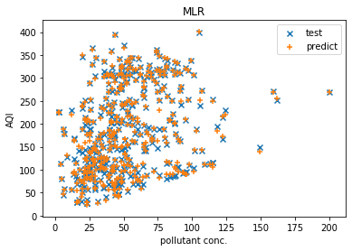
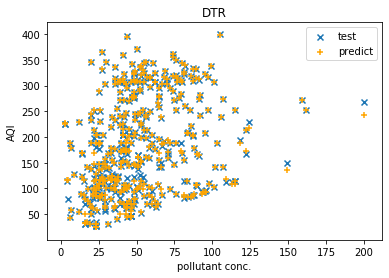
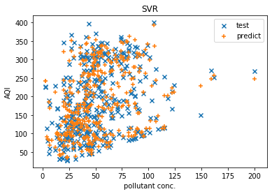
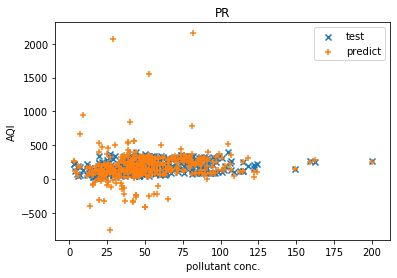

# Comparison-of-ML-models-for-predicting-AQI

### Goal ###
In this project we are comparing various machine learning models to find which model works better for predicting the AQI (Air Quality Index).

### Machine learning models used ###
In this project we are using regression models such as:
* Multiple Linear Regression
* Polynomial Regression
* Decision Tree Regression
* Random Forest Regression
* Support Vector regression (SVR)

__Libraries Used__: numpy, pandas, sklearn  
__IDE used__: spyder (Anaconda 3)

### Error Metrics Used ###
In this project we have used the following error metrics to evaluate and compare our models:
* Coefficient of determination (R^2)
* Root Mean Square Error (RMSE) 
* Mean absolute error (MAE)
* Root Mean Squared Logarithmic Error (RMSLE)

### AQI table ###

### Data Source ###
The [data set](https://data.gov.in/resources/real-time-air-quality-index-various-locations) is taken from Open Government Data (OGD) Platform India. The site provides Real time National Air Quality Index values from different monitoring stations across India. The pollutants monitored are Sulphur Dioxide (SO2), Nitrogen Dioxide (NO2), Particulate Matter (PM10 and PM2.5) , Carbon Monoxide (CO), Ozone(O3) etc. The site provides data on hourly basis thus the site's data is refreshed every hour.

### Result ###
* Results on training set:

models | R^2  |   RMSE |   MAE |    RMSLE
-------|------|--------|-------|--------
MLR   |  0.9965 | 5.9334 | 3.2952 | 0.0595
Decision Tree  |  1.0000 | 0.0000 | 0.0000 | 0.0000
Random Forest   |  0.9996 | 2.0237 | 0.7106 | 0.0195
SVR   |  0.9494 | 22.628 | 16.076 | 0.1423
Poly R   |  1.00   | 0.09   | 0.018  | 0.0012

* Results on testing set:

Models | R^2 | RMSE | MAE | RMSLE
-------|-----|------|-----|------
MLR    |0.9965| 5.4973 | 3.4796 | 0.0517
Decision Tree | 0.9955 | 6.2370 | 2.354 | 0.0563 
Random Forest |0.9982| 3.8577 | 1.7016 | 0.0422
SVR | 0.9164 | 27.0025 | 19.0722 | 0.1686
Poly R | -4.1417 | 211.8759 | 81.5855 | 0.4638

### Prediction results ###
 
 

### Conclusion ###
From the above table it is evident that the _Random Forest Regressor_ performed the best out of all other regression models.
